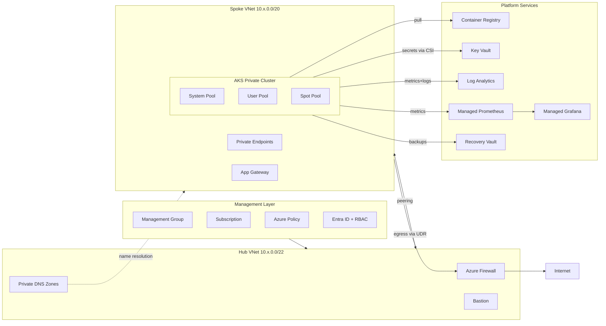
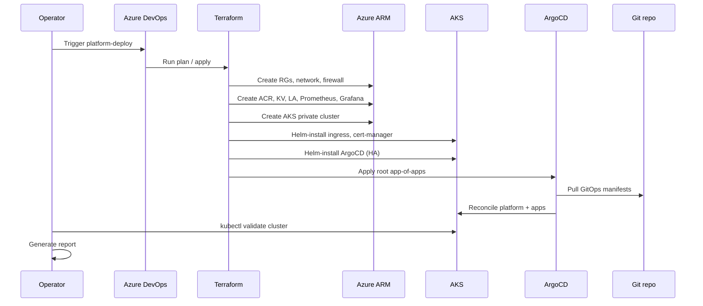
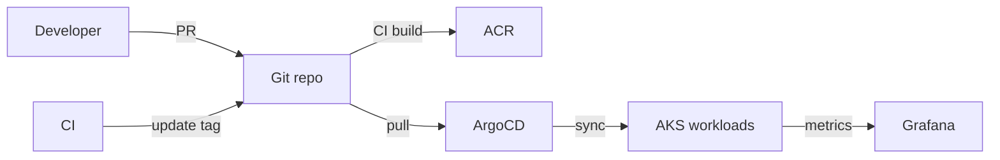

# AKS Platform Engineering — Production-Grade Landing Zone

A reusable, enterprise Kubernetes platform on Azure, built around AKS, ArgoCD GitOps, Terraform, and a Hub-Spoke landing zone. All infrastructure provisioning and validation are orchestrated automatically via **Azure DevOps CI/CD Pipelines**.

## CI/CD Quick Start (Azure DevOps)

This project uses two core pipelines under the [pipelines/azure-devops/](pipelines/azure-devops/) directory:

### 1. Prerequisites & Azure Setup
Before running the pipelines:
* Ensure you have an **Azure DevOps Project** connected to your repository.
* Configure a **Service Connection** in Azure DevOps named `azure-platform-connection` with access/permissions to your Azure subscription.
* Create a resource group (`rg-tfstate`), standard storage account (`sttfstateplatform`), and storage container (`tfstate`) to store the Terraform remote state files securely.

### 2. Platform Validation Pipeline (CI)
* **Configuration File**: [`pipelines/azure-devops/platform-ci.yml`](pipelines/azure-devops/platform-ci.yml)
* **Triggers**: Automatically triggered on any Pull Request or merge to the `main` branch.
* **Process**:
  1. Installs Terraform, runs formatting checks (`terraform fmt`), and validates files (`terraform validate`).
  2. Runs static code analysis (`tflint`) and Helm linting.
  3. Conducts security vulnerability scans using `checkov`, `tfsec`, and `trivy`.
  4. Generates a dry-run Terraform execution plan for the `dev` environment.

### 3. Platform Deployment & Teardown Pipeline (CD)
* **Configuration File**: [`pipelines/azure-devops/platform-deploy.yml`](pipelines/azure-devops/platform-deploy.yml)
* **Triggers**: Manual trigger from the Azure DevOps UI (does not trigger automatically).
* **Parameters**:
  * `environment`: `dev` | `qa` | `uat` | `prod` (Target environment to run against)
  * `action`: `plan` | `apply` | `destroy` (Terraform action to perform)
* **How to run**:
  1. Go to **Pipelines** in Azure DevOps and select the deployment pipeline.
  2. Click **Run pipeline**.
  3. Select the target **Environment** and the desired **Action** (use `apply` to deploy the infrastructure and GitOps workloads, or `destroy` to fully tear them down).

## What you get

| Layer            | Components                                                         |
| ---------------- | ------------------------------------------------------------------ |
| Management       | Resource groups, naming standards, tags, Azure Policy, RBAC        |
| Networking       | Hub-Spoke VNet, NSGs, UDR, Azure Firewall, Bastion, Private DNS    |
| AKS              | Private cluster, system/user/spot pools, OIDC, Workload Identity   |
| Containers       | Premium ACR with private endpoint, geo-replication, image scanning |
| GitOps           | ArgoCD HA, app-of-apps, AppProjects, env-promotion                 |
| Observability    | Log Analytics, Container Insights, Managed Prometheus, Grafana     |
| Security         | Defender for Cloud, Key Vault + CSI, Network Policies, Gatekeeper  |
| Backup/DR        | Velero + Azure Storage, Recovery Services Vault                    |
| CI/CD            | GitHub Actions & Azure DevOps pipelines                            |

## Repository layout

```
platform-engineering/
├── terraform/        Root Terraform + reusable modules
├── environments/     Per-env tfvars + backend.hcl  (dev|qa|uat|prod)
├── kubernetes/       Namespaces, NetworkPolicies, RBAC
├── helm/             Sample app Helm chart + per-env values
├── argocd/           AppProjects + Applications + app-of-apps
└── pipelines/        GitHub Actions + Azure DevOps definitions
```

## Architecture

### End-to-End Overview
The landing zone uses a secure Hub-Spoke virtual network topology. The private AKS cluster is isolated in the spoke network, with all egress traffic routed through Azure Firewall in the hub network. Private Endpoints are used for secure backend service connectivity (ACR, Key Vault).



### Deployment Flow
Infrastructure and configuration are initialized and updated securely via Azure DevOps pipeline runs:



### GitOps Flow
Workloads and platform updates are automatically synchronized to the cluster from Git manifests via ArgoCD:



### Environment Promotion
Changes flow sequentially through non-production environments to production:

```
dev (auto-sync)  →  qa (auto-sync)  →  uat (auto-sync)  →  prod (manual-sync)
                                                            ↑
                                                            change-managed
```
A commit to `main` branch flows automatically through `dev`, `qa`, and `uat` environments. Production deployments require a change management ticket and manual sync trigger in ArgoCD.
